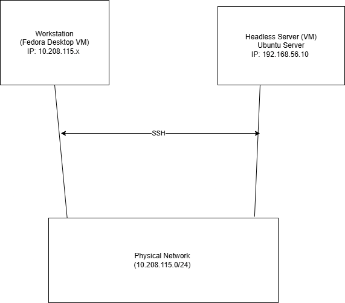

# 🗓️ Week 1: System Planning and Distribution Selection

This week focuses on planning the system architecture, selecting the server distribution, and documenting the initial setup.

---

## 1. 🧩 System Architecture Diagram

Below is the system architecture diagram showing the two-system setup, network connection, and planned IP addresses.



> **Note:**  
> Ensure your diagram image file is uploaded to your GitHub repository as **`architecture.png`** for it to appear correctly.

---

## 2. 💿 Distribution Selection Justification

For my server system, I selected **Ubuntu Server 22.04 LTS**.  
The primary alternative I considered was **Fedora Server**.

### Justification

- **Stability vs. Bleeding-Edge:**  
  I chose Ubuntu Server because its Long-Term Support (LTS) version provides a stable, reliable platform with security updates for 5 years.  
  This stability is critical for a server environment and preferable to Fedora Server’s more frequent, bleeding-edge release cycle.

- **Security Module:**  
  Ubuntu uses **AppArmor** by default, while Fedora uses **SELinux**.  
  Since implementing Mandatory Access Control is a requirement for Phase 5, I will focus on learning and configuring AppArmor.

- **Package Management:**  
  I am more familiar with the `apt` package manager and `.deb` packages used by Ubuntu, which allows for faster configuration and troubleshooting.

- **Community and Documentation:**  
  Ubuntu has a very large user community and comprehensive documentation.  
  As a student, this strong support network is a major advantage for troubleshooting and learning.

---

## 3. 🖥️ Workstation Configuration Decision

I am using a **Fedora Desktop VM** as my administrative workstation, which runs on a separate physical machine from my **Ubuntu Server VM**.

This approach fully meets the *dual-system architecture* requirement.  
It provides a dedicated, isolated Linux environment to perform all remote administration tasks via SSH.  
This setup mirrors a professional environment where administrators use their own machines to manage remote servers — helping to develop essential command-line and remote management skills.

---

## 4. 🌐 Network Configuration Documentation

Since my server and workstation VMs are on two different physical host machines, a "Host-Only Network" (like the one in my initial diagram) is not possible.

Instead, both VMs use a **"Bridged Adapter"** setting in VirtualBox. This connects both VMs directly to my physical home network, allowing them to communicate. My documentation and diagram will be updated to reflect this correct "Bridged" setup.

| Configuration Item | Setting / Value |
|---------------------|-----------------|
| **VirtualBox Network Type (Both VMs)** | **Bridged Adapter** |
| **Physical Network** | Home LAN (`10.208.115.0/24`) |
| **Server IP (Ubuntu)** | `10.208.115.17` (Dynamic) |
| **Workstation IP (Fedora)** | (Will be assigned by DHCP) |

> **Note:** My `ip addr` output confirms this bridged setup. I will later configure a *static* IP for the server (e.g., `10.208.115.50`) as required.

---

## 5. ⚙️ System Specifications

Here are the initial specifications for the headless Ubuntu server, captured from the direct console.

### 🧠 `uname -a`
```bash
Linux Ubuntu 6.14.0-35-generic #3524.04.1-Ubuntu SMP PREEMPT_DYNAMIC Tue Oct 14 13:55:17 UTC 2 x86_64 x86_64 x86_64 GNU/Linux;
```
---

### Memory `free -h`
```bash
              total         used         free      shared   buff/cache   available
Mem:          7.8Gi        1.0Gi        6.0Gi        32Mi        1.1Gi       6.8Gi
Swap:            0B           0B           0B;
```

### 📁 `df -h`
```bash
Filesystem      Size  Used Avail Use% Mounted on
tmpfs           795M  1.7M  793M   1% /run
/dev/sda2       251G  5.3G  233G   3% /
tmpfs           3.9G     0  3.9G   0% /dev/shm
tmpfs           5.0M  8.0K  5.0M   1% /run/lock
tmpfs           795M   152K  795M   1% /run/user/1000
```

### 🌍 `ip addr`
```bash
1: lo: <LOOPBACK,UP,LOWER_UP> mtu 65536 qdisc noqueue state UNKNOWN group default qlen 1000
    link/loopback 00:00:00:00:00:00 brd 00:00:00:00:00:00
    inet 127.0.0.1/8 scope host lo
       valid_lft forever preferred_lft forever
    inet6 ::1/128 scope host noprefixroute
       valid_lft forever preferred_lft forever

2: enp0s3: <BROADCAST,MULTICAST,UP,LOWER_UP> mtu 1500 qdisc fq_codel state UP group default qlen 1000
    link/ether 08:00:27:e9:b8:6d brd ff:ff:ff:ff:ff:ff
    inet 10.208.115.17/24 brd 10.208.115.255 scope global dynamic noprefixroute enp0s3
       valid_lft 431737sec preferred_lft 431737sec
    inet6 fe80::a00:27ff:fee9:b86d/64 scope link
       valid_lft forever preferred_lft forever
```

### 🧾 `lsb_release -a`
```bash
No LSB modules are available.
Distributor ID: Ubuntu
Description:    Ubuntu 24.04.3 LTS
Release:        24.04
Codename:       noble
```

---

[Back to Home](README.md)


