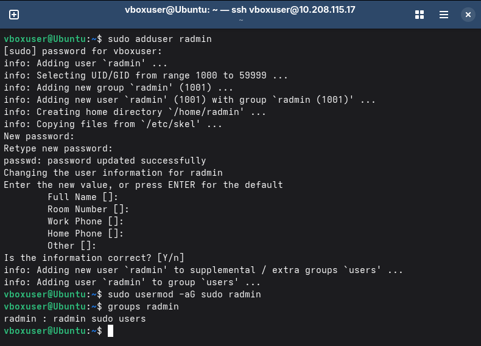
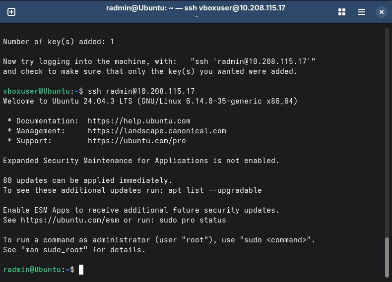
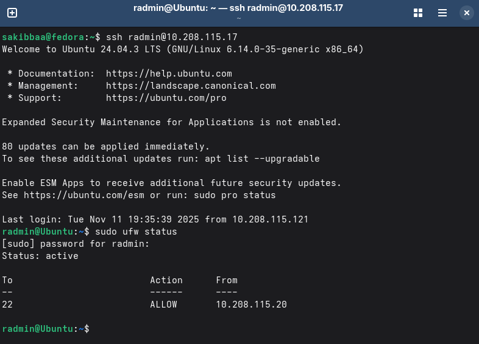

# 🗓️ Week 4: Initial System Configuration & Security Implementation

This week, I moved from planning to implementation. The goal was to configure the foundational security for the headless Ubuntu server, as outlined in my `week2.md` security checklist and the Phase 4 requirements.

All tasks were performed remotely from my Fedora workstation via SSH, as required by the administrative constraint.

---

## 1. 👤 User & Privilege Management

My first task was to stop using the default user and create a new, non-root administrator.

I connected to the server via SSH and ran the following commands:
1.  `sudo adduser radmin`: To create the new user.
2.  `sudo usermod -aG sudo radmin`: To add the new user to the `sudo` group.
3.  `groups radmin`: To verify the user was correctly added to the `sudo` group.

**Evidence (Remote Administration Evidence):**
*Below is a screenshot of my Fedora terminal showing the successful execution of these commands.*



---

## 2. 🔑 SSH Hardening with Key-Based Authentication

This was the most critical task. I hardened the SSH service to disable password-based logins and enforce key-based authentication.

**Process:**
1.  **Key Generation:** On my Fedora workstation, I ran `ssh-keygen` to generate a new SSH key pair.
2.  **Key Transfer:** I then logged into the server as `radmin` (in a separate terminal) and used `nano /home/radmin/.ssh/authorized_keys` to manually paste my public key.
3.  **Permissions:** I fixed the server-side permissions, which were preventing the key from being accepted:
    * `chmod 700 /home/radmin/.ssh`
    * `chmod 600 /home/radmin/.ssh/authorized_keys`
4.  **Configuration:** I edited the SSH configuration file with `sudo nano /etc/ssh/sshd_config`.
5.  **Restart Service:** I applied the changes with `sudo systemctl restart ssh.service`.

**SSH Access Evidence:**
*Screenshot of my successful SSH login from my Fedora workstation as the `radmin` user *after* password authentication was disabled.*



**Configuration Files (Before & After):**
*The following lines were changed in `/etc/ssh/sshd_config`.*

**Before:**
```bash
#PermitRootLogin prohibit-password
#PasswordAuthentication yes
```

**After:**
```bash
PermitRootLogin no
PasswordAuthentication no
```

## 3. 🔥 Firewall Configuration

Finally, I configured the ufw (Uncomplicated Firewall) to secure the server and permit SSH only from my specific workstation IP.

### Process:

1.  `sudo apt install ufw`: Installed the firewall.
2.  `sudo ufw default deny incoming`: Set the default policy to block all incoming traffic.
3.  `sudo ufw default allow outgoing`: Allowed all outgoing traffic.
4.  `sudo ufw allow from 10.208.115.20 to any port 22`: Created the specific rule to allow SSH only from my Fedora workstation (IP: 10.208.115.20).
5.  `sudo ufw enable`: Enabled the firewall.

### Firewall Documentation:

The final, active ruleset on the server, captured with `sudo ufw status`. This screenshot shows the correct rule allowing my workstation IP (10.208.115.20).



[Back to Home](README.md)
