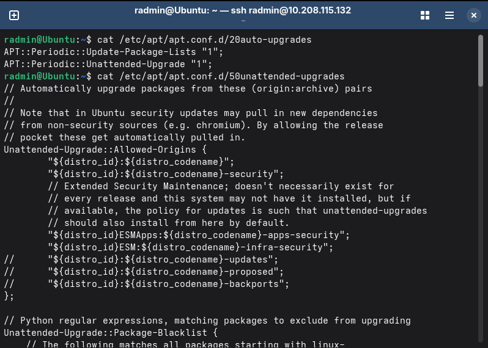
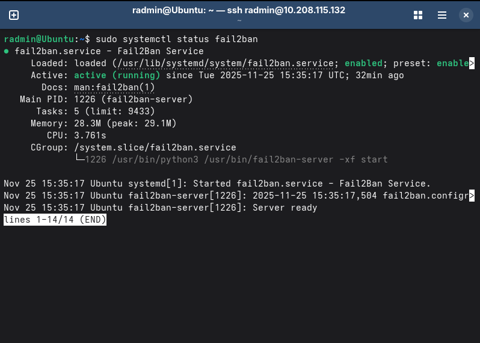
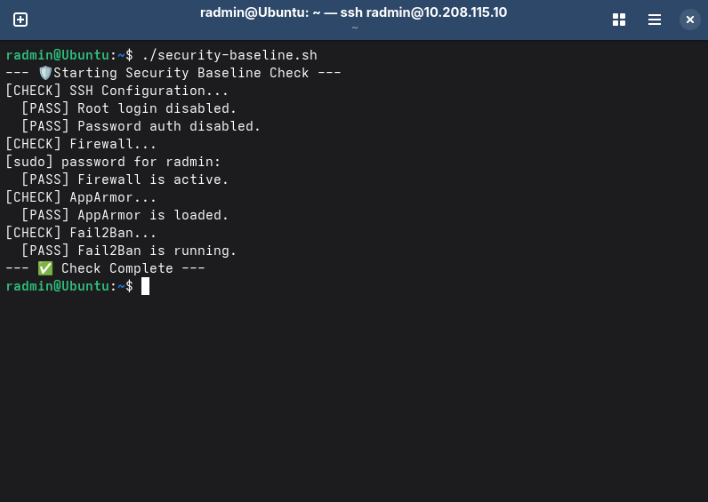

# 🗓️ Week 5: Advanced Security and Monitoring Infrastructure

This week focused on implementing advanced security controls and developing automated monitoring capabilities. I configured Mandatory Access Control (MAC), established automatic updates, deployed intrusion detection, and wrote custom shell scripts to verify security and monitor performance.

---

## 1. 🛡️ Access Control (AppArmor)

I utilized AppArmor to enforce mandatory access control on the Ubuntu server. This ensures that services like SSH are restricted to only necessary system resources, limiting the potential impact of a compromise.

**Evidence of Access Control:**
I verified the status of the AppArmor module to ensure profiles are loaded and active. The screenshot below confirms that the module is loaded and profiles are in "enforce" mode.


---

## 2. 🔄 Automatic Security Updates

To minimize the "window of vulnerability" for new threats, I configured the server to automatically install security updates without administrator intervention.

**Implementation Details:**
* **Package:** Installed `unattended-upgrades`.
* **Configuration:**
    * Modified `/etc/apt/apt.conf.d/50unattended-upgrades` to enable the security update stream.
    * Modified `/etc/apt/apt.conf.d/20auto-upgrades` to enable automatic download and installation intervals ("1").

**Evidence of Implementation:**
The screenshot below displays the active configuration files proving that automatic updates are enabled.



---

## 3. 🚨 Intrusion Detection (Fail2Ban)

I implemented `fail2ban` to protect the SSH service from brute-force attacks. This service monitors log files for repeated failed login attempts and automatically modifies the firewall rules to ban the offending IP address.

**Configuration:**
* Created a local configuration file at `/etc/fail2ban/jail.local` to enable the SSH jail:
    ```ini
    [sshd]
    enabled = true
    ```

**Evidence of Operation:**
The screenshots below show the active service status and the specific status of the SSH jail proving it is currently monitoring for attacks.



---

## 4. ✅ Security Baseline Verification Script

I developed a shell script named `security-baseline.sh` that runs directly on the server. This script automates the process of verifying that all security controls from Phase 4 and Phase 5 are active and correctly configured.

**Script Source Code (`security-baseline.sh`):**

```bash
#!/bin/bash
# security-baseline.sh
# Verifies configurations from Phase 4 & 5

echo "--- 🛡️ Starting Security Baseline Check ---"

# 1. SSH Hardening
echo "[CHECK] SSH Configuration..."
# Search for the exact phrase "PermitRootLogin no" in the config file. 
# -q suppresses output (quiet mode), only returning a success/fail exit code.
if grep -q "^PermitRootLogin no" /etc/ssh/sshd_config; then
    echo "  [PASS] Root login disabled."
else
    echo "  [FAIL] Root login enabled!"
fi

# Search for "PasswordAuthentication no" at the start of a line (^)
if grep -q "^PasswordAuthentication no" /etc/ssh/sshd_config; then
    echo "  [PASS] Password auth disabled."
else
    echo "  [FAIL] Password auth enabled!"
fi

# 2. Firewall
echo "[CHECK] Firewall..."
# Check the status of the Uncomplicated Firewall (ufw).
# We pipe (|) the output to grep to search for "Status: active".
if sudo ufw status | grep -q "Status: active"; then
    echo "  [PASS] Firewall is active."
else
    echo "  [FAIL] Firewall is inactive!"
fi

# 3. AppArmor
echo "[CHECK] AppArmor..."
# Check the status of AppArmor profiles.
# Look for the specific string confirming the kernel module is loaded.
if sudo aa-status | grep -q "apparmor module is loaded"; then
    echo "  [PASS] AppArmor is loaded."
else
    echo "  [FAIL] AppArmor is NOT loaded!"
fi

# 4. Fail2Ban
echo "[CHECK] Fail2Ban..."
# Check if the fail2ban service is currently active and running.
# --quiet prevents status text from printing; we only want the exit code.
if systemctl is-active --quiet fail2ban; then
    echo "  [PASS] Fail2Ban is running."
else
    echo "  [FAIL] Fail2Ban is NOT running!"
fi

echo "--- ✅ Check Complete ---"
```



## 5. 📊 Remote Monitoring Script

To satisfy the remote monitoring requirement, I created a script named `monitor-server.sh` on my **Fedora Workstation**. Unlike the security script (which runs *on* the server), this script runs on my local machine and uses SSH to retrieve performance data from the remote server without needing an interactive login.

**Script Source Code (`monitor-server.sh`):**

```bash
#!/bin/bash
# monitor-server.sh
# Runs on workstation to monitor remote server via SSH

# Configuration
# The IP address of the target Ubuntu server
SERVER_IP="10.208.115.132"
# The username to log in with (must have SSH keys configured)
USER="radmin"

echo "--- 📊 Starting Remote Server Monitor ---"
echo "Target: $USER@$SERVER_IP"
echo "-----------------------------------------"

# 1. Check Connectivity
echo "[CHECK] Network Connectivity..."
# Send exactly 1 ping packet (-c 1)
# Wait max 2 seconds for a response (-W 2) to avoid hanging
# Redirect output to /dev/null to keep the terminal clean
if ping -c 1 -W 2 "$SERVER_IP" > /dev/null; then
    echo "  [OK] Server is reachable."
else
    # If ping fails, print error and exit the script immediately with error code 1
    echo "  [FAIL] Server is NOT reachable. Exiting."
    exit 1
fi

# 2. Check Metrics via SSH
echo ""
echo "[METRIC] System Uptime & Load:"
# Connect via SSH and run 'uptime' to see how long the system has been running
ssh "$USER@$SERVER_IP" "uptime"

echo ""
echo "[METRIC] Memory Usage (MB):"
# Connect via SSH and run 'free -m' to show memory in Megabytes
ssh "$USER@$SERVER_IP" "free -m"

# 3. Check Disk Usage & Activity
echo ""
echo "[METRIC] Disk Usage (Space):"
# Connect via SSH and check disk space (df) in human-readable format (-h) for root (/)
ssh "$USER@$SERVER_IP" "df -h /"

echo ""
echo "[METRIC] Disk Activity (IO):"
# Run 'vmstat' to get virtual memory statistics
# '1' means update every 1 second
# '5' means run for 5 counts (5 seconds total)
ssh "$USER@$SERVER_IP" "vmstat 1 5"

echo ""
echo "--- ✅ Monitoring Complete ---"
````

**Evidence of Operation:**
*Please refer to Week 6 to see the successful output of this monitoring script.*

---
## References

[1] Fail2Ban, “Fail2Ban Manual,” *Fail2Ban.org*, 2024. [Online]. Available: https://www.fail2ban.org/

[2] Canonical Ltd., “Automatic Updates,” *Ubuntu Documentation*, 2024. [Online]. Available: https://help.ubuntu.com/community/AutomaticSecurityUpdates


[Back to Home](README.md)

