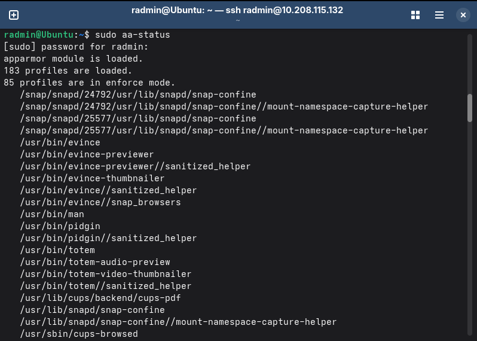

# 🗓️ Week 5: Advanced Security & Monitoring

## 1. 🛡️ Access Control (AppArmor)

I utilized AppArmor to enforce mandatory access control on the server.

**Evidence of Access Control Status:**
The following screenshot confirms that the AppArmor module is loaded and profiles are active in "enforce" mode, securing the system services.

