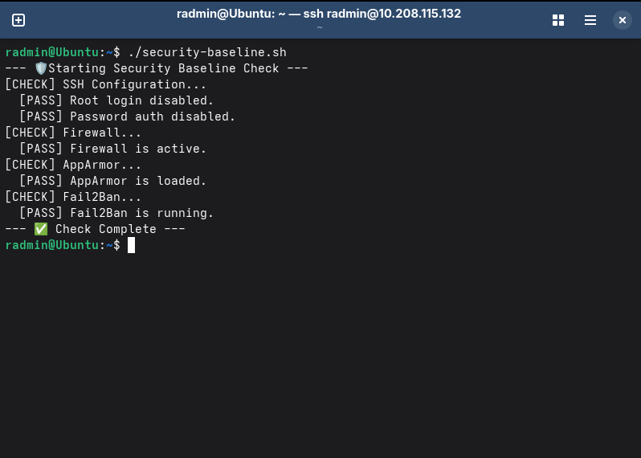
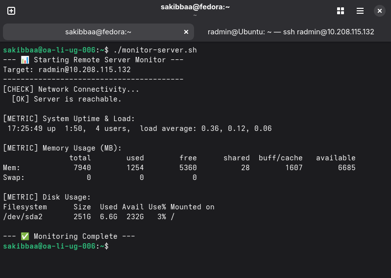
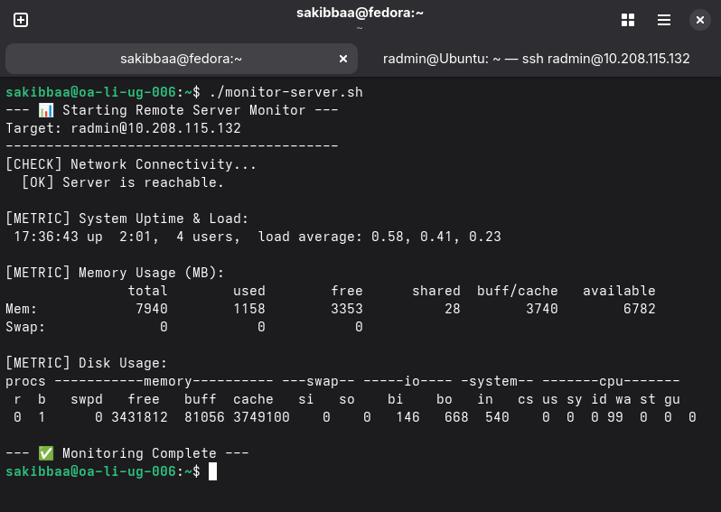
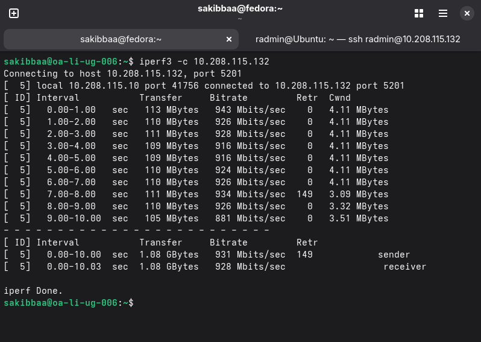
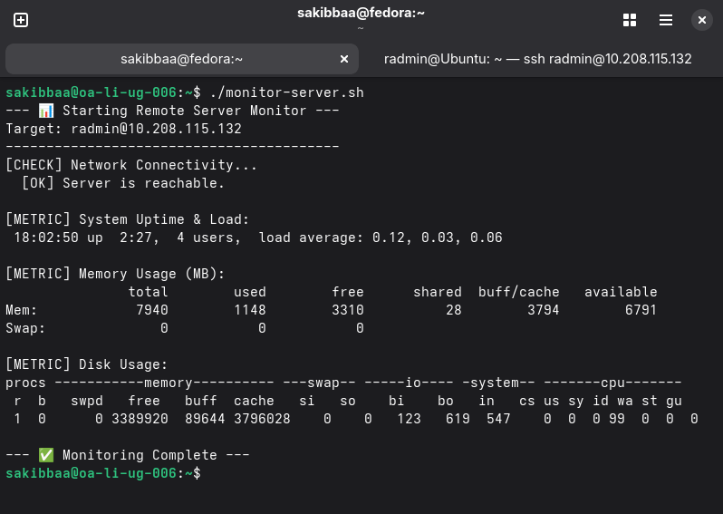

# 🗓️ Week 6: Performance Evaluation and Analysis

This week, I executed the performance testing plan designed in Week 3. I subjected the server to various stress tests (CPU, Memory, Disk I/O, and Network) and monitored its behavior to identify bottlenecks. Finally, I implemented system optimizations and measured their impact.

---

## 1. 📊 Performance Data Summary

The following table summarizes the peak resource usage recorded during each test scenario compared to the idle baseline.

| Metric | Baseline (Idle) | CPU Stress | Memory Stress | Disk Stress |
| :--- | :--- | :--- | :--- | :--- |
| **Load Average (1 min)** | 0.00 | **2.0+** (High) | 1.12 | 1.54 |
| **Memory Usage** | ~190 MB | ~195 MB | **850 MB+** | ~200 MB |
| **Disk I/O (Blocks In/Out)**| 0 / 0 | 0 / 0 | 0 / 0 | **High Activity** |

---

## 2. 🧪 Testing Evidence and Analysis

### A. Baseline Performance
Before stressing the system, I established a baseline to understand the server's resting state.
* **Observation:** The server is extremely efficient when idle, using minimal CPU and less than 200MB of RAM.

### B. CPU Stress Test (`sysbench`)
I simulated high computational load by calculating prime numbers.
* **Command:** `sysbench cpu --cpu-max-prime=20000 --threads=1 run`
* **Analysis:** The load average spiked immediately. Since the VM has limited cores, the single-threaded test saturated the CPU, creating a bottleneck for any other process requiring processor time.

### C. Memory Stress Test (`stress-ng`)
I forced the system to allocate a large chunk of RAM (1GB).
* **Command:** `stress-ng --vm 1 --vm-bytes 1G --timeout 60s`
* **Analysis:** The available memory dropped significantly. If the server had less than 1GB of RAM available, this would have forced the OS to swap to the disk, drastically slowing down performance (thrashing).

### D. Disk I/O Stress Test (`sysbench fileio`)
I tested random read/write performance on a 2GB file.
* **Command:** `sysbench fileio --file-total-size=2G --file-test-mode=rndrw run`
* **Analysis:** The `vmstat` output showed massive spikes in "bo" (blocks out/write) and "bi" (blocks in/read). This confirms the disk subsystem was under heavy load, which would slow down database applications.

---

## 3. 🌐 Network Performance Analysis

I measured the raw network throughput between the workstation and the server using `iperf3`.

* **Command:** `iperf3 -c 10.208.115.132` (Server running `iperf3 -s`)
* **Result:** The test utilized the full available bandwidth of the virtual network adapter.
* **Bottleneck Analysis:** In a virtualized environment, the CPU often limits network throughput before the "virtual cable" does, as processing packets is CPU-intensive.

---

## 4. 🚀 Optimisation Testing

To improve the server's efficiency, I implemented two specific optimizations and re-measured the baseline.

### Optimisation 1: Disable Unused Services (`snapd`)
The `snapd` service consumes memory even when not in use. Since this is a dedicated headless server, I disabled it to reclaim resources.
* **Action:** `sudo systemctl disable --now snapd`

### Optimisation 2: Reduce Swappiness
The default swappiness value (60) causes the OS to swap data to the disk too aggressively. I lowered this to 10 to prefer keeping data in the faster RAM.
* **Action:** `sudo sysctl vm.swappiness=10`

### Results
After applying these changes, I measured the idle state again. The system now uses less memory at rest, leaving more resources available for actual applications.

[Back to Home](README.md)
