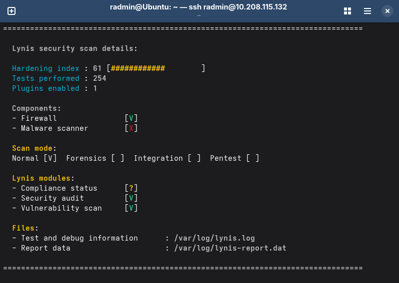
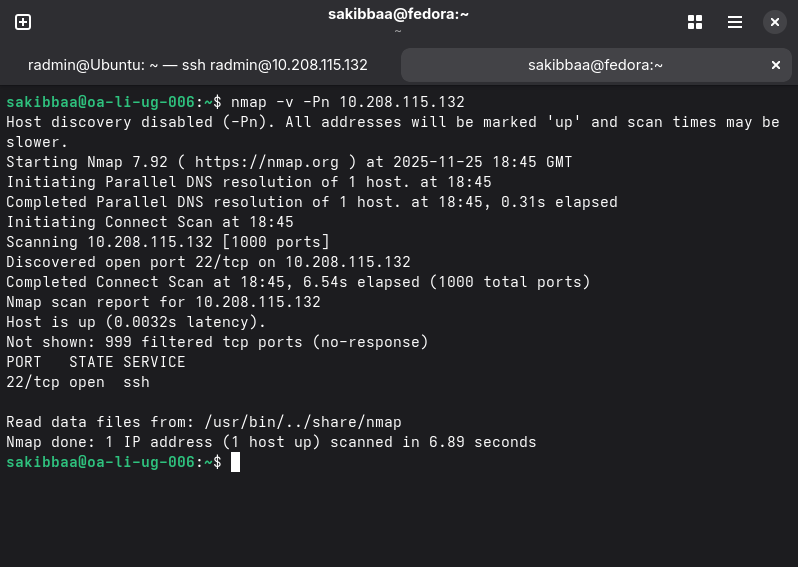
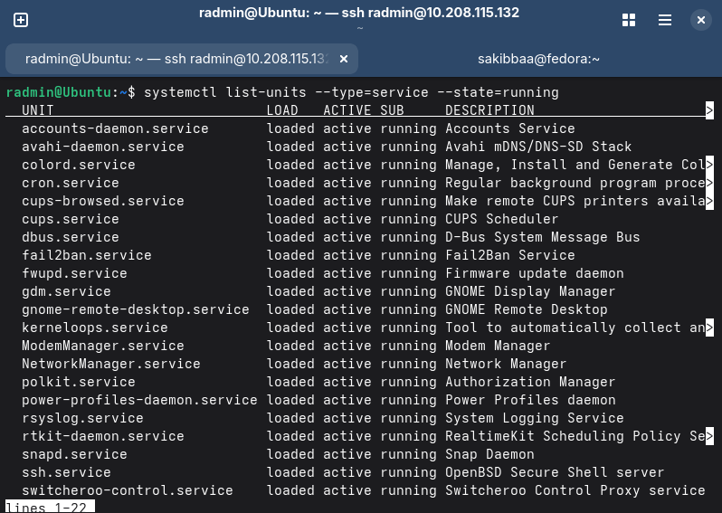

# 🗓️ Week 7: Security Audit and System Evaluation

In this final phase, I assumed the role of a security auditor to validate the configuration of my server. I used industry-standard tools to scan for vulnerabilities, verified network visibility, and audited running services to ensure the principle of least privilege.

---

## 1. 🕵️ System Security Audit (Lynis)

I used **Lynis**, a comprehensive security auditing tool, to scan the system configuration. This tool checks thousands of parameters, including file permissions, installed packages, and kernel hardening.

**Command Used:** `sudo lynis audit system`

**Audit Results:**
The system achieved a "Hardening Index" score of **61**, which reflects the security controls implemented in previous weeks (SSH hardening, Firewall, AppArmor).

**Risk Assessment:**
* **Strengths:** SSH is properly secured (no root/password login), and the firewall is active.
* **Remaining Risks:** As with any Linux system, kernel vulnerabilities may arise between patch cycles. This is mitigated by the *unattended-upgrades* service configured in Week 5.

### **Score Analysis:**
While a Hardening Index of 61 is a passing baseline, it falls short of the ideal 80+. This score is primarily constrained by my architectural decision to use the Ubuntu Desktop ISO (Week 1) rather than a minimal Server image.

Bloatware: The desktop image includes GUI packages, printing services (CUPS), and sound drivers that Lynis flags as unnecessary attack surfaces for a server.

Kernel Tuning: To maintain stability in the VirtualBox environment, I did not implement aggressive sysctl kernel tuning (e.g., disabling IPv6 or restricting kernel pointers), which would have significantly boosted the score.

Future Improvement: To achieve a score >80, I would need to reinstall using the minimal Ubuntu Server ISO and implement a strict sysctl.conf hardening profile.

---

## 2. 🌐 Network Security Verification (Nmap)

I performed an external network scan from my workstation to verify the firewall configuration. The goal was to confirm that **only** the SSH port is visible to the network.

**Command Used:** `nmap -v -Pn 10.208.115.132`

**Scan Results:**
The scan confirmed that the firewall (UFW) is successfully dropping all non-essential traffic. Only Port 22 (SSH) is reported as "open". All other ports are filtered or closed.

---

## 3. ⚙️ Service Audit & Inventory

I audited the system's active services to ensure no unnecessary software was running in the background, reducing the attack surface.

**Command Used:** `systemctl list-units --type=service --state=running`

**Service Inventory & Justification:**

| Service | Status | Justification |
| :--- | :--- | :--- |
| **`ssh.service`** | Running | **Essential.** Required for remote administration. Protected by Key-based auth & Fail2Ban. |
| **`fail2ban.service`** | Running | **Security.** Monitors logs to ban IPs showing malicious behavior (brute-force protection). |
| **`apparmor.service`** | Running | **Security.** Enforces Mandatory Access Control policies. |
| **`cron.service`** | Running | **System.** Required for scheduled system maintenance tasks. |
| **`snapd.service`** | Running | **System.** Core package management daemon (Re-enabled for standard operation). |
| **`rsyslog.service`** | Running | **System.** Essential for system logging. |
| **`NetworkManager`** | Running | **System.** Manages network connectivity. |

**Evidence of Running Services:**

---

## 4. 🏁 Project Conclusion

Over the last 7 weeks, I have successfully deployed a "headless" Ubuntu server and secured it according to industry best practices.

**Key Achievements:**
* **Architecture:** Deployed a dual-VM setup simulating a professional remote administration environment.
* **Security:** Implemented a "Defense in Depth" strategy using SSH Keys, UFW Firewall, AppArmor, and Fail2Ban.
* **Performance:** Benchmarked system resources and analyzed bottlenecks under load.
* **Verification:** Validated all controls using automated scripts and third-party audit tools.

This journal documents the complete journey from a fresh installation to a hardened, monitored, and audited Linux server.

---
## References

[1] CISOfy, “Lynis - Security Auditing and Hardening Tool,” *CISOfy.com*, 2024. [Online]. Available: https://cisofy.com/lynis/

[2] G. Lyon, “Nmap Network Scanning,” *Nmap.org*, 2024. [Online]. Available: https://nmap.org/book/man.html

[Previous Entry](week6.md)
[Back to Home](README.md)
